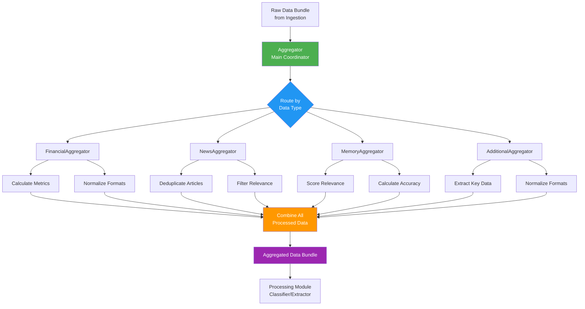
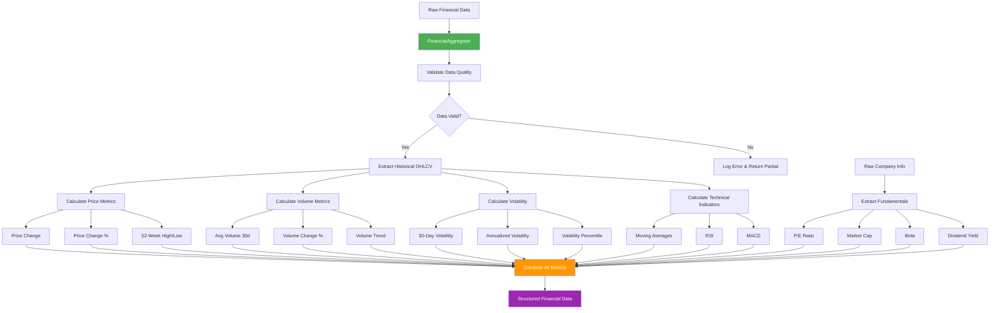
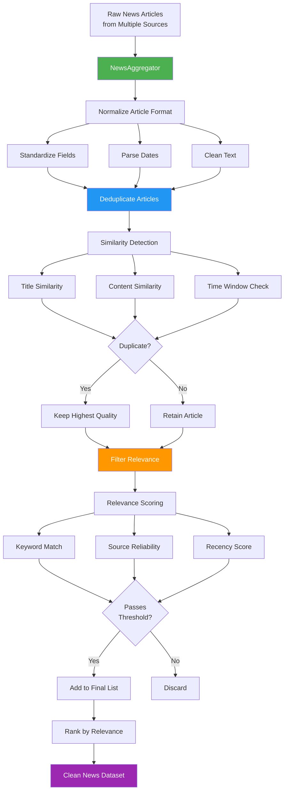
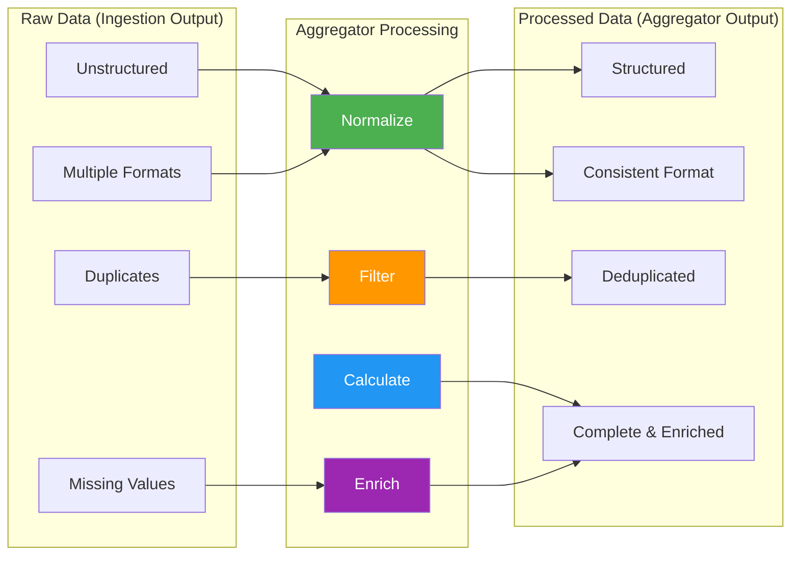
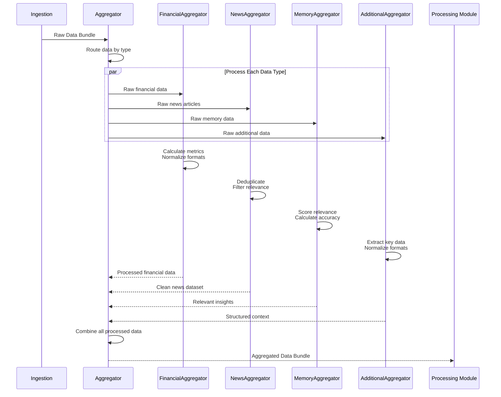

# Aggregator Module - Architecture & Flow

## Overview

The **Aggregator Module** is responsible for processing, normalizing, and enriching raw data from the Ingestion layer. It acts as the second stage in the data pipeline, transforming unstructured raw data into clean, structured, analysis-ready information.

## Core Principle

**Aggregation = Data Processing & Normalization**

- ✅ Clean and validate raw data
- ✅ Normalize data formats across different sources
- ✅ Calculate derived metrics and indicators
- ✅ Filter and deduplicate data
- ✅ Structure data for downstream analysis
- ✅ Enrich data with calculated features
- ❌ NO final recommendations (that's for downstream modules)
- ❌ NO sentiment analysis (handled by Processing module)
- ❌ NO summarization (handled by Summarizer module)

---

## Architecture

### Component Structure

```
src/aggregator/
├── aggregator.py             # Main coordinator
├── financial.py              # Financial data processing & metrics calculation
├── news.py                   # News data normalization & deduplication
├── memory.py                 # Memory data processing (to be added)
├── additional.py             # Additional data processing (to be added)
└── aggregator-flow.md        # This documentation
```

---

## Aggregator Responsibilities by Type

### Financial Aggregator (`financial.py`)
**Input**: Raw OHLCV data, raw company info from yfinance  
**Processing**:
- Calculate derived metrics (volatility, price changes, percentages)
- Compute volume averages
- Calculate technical indicators
- Normalize financial ratios (P/E, dividend yield, beta)
- Extract key company information
- Format historical data for analysis

**Output**: Structured financial metrics ready for analysis

### News Aggregator (`news.py`)
**Input**: Raw news articles from multiple sources (NewsAPI, Yahoo RSS, Kaggle)  
**Processing**:
- Normalize article format across sources
- Deduplicate similar/identical articles
- Filter irrelevant or low-quality articles
- Standardize date formats
- Extract and clean article text
- Add metadata (source reliability, recency score)

**Output**: Clean, deduplicated list of relevant news articles

### Memory Aggregator (`memory.py`) - To Be Implemented
**Input**: Raw past analyses and learned patterns  
**Processing**:
- Normalize historical recommendation formats
- Calculate accuracy metrics of past predictions
- Identify relevant patterns for current analysis
- Filter outdated or irrelevant insights
- Rank insights by relevance and confidence

**Output**: Structured historical insights with relevance scores

### Additional Data Aggregator (`additional.py`) - To Be Implemented
**Input**: Raw macro indicators, SEC filings, Senate trading data  
**Processing**:
- Normalize economic indicator formats
- Extract key sections from SEC filings
- Categorize Senate trading patterns
- Calculate market index correlations
- Identify significant regulatory events

**Output**: Structured contextual market data

---

## Flowcharts

### High-Level Aggregation Flow



### Detailed Financial Aggregation Flow



### Detailed News Aggregation Flow



### Data Transformation Flow



### Sequence Diagram: Ingestion → Aggregator → Processing



---

## Data Structures

### Input to Aggregator (from Ingestion)

**Raw Data Bundle Structure:**
```json
{
  "symbol": "AAPL",
  "timestamp": "2025-10-03T12:00:00Z",
  "financial_data": {
    "historical": "DataFrame[OHLCV]",
    "info": { "raw company info" }
  },
  "news_data": [
    { "raw article 1" },
    { "raw article 2" }
  ],
  "memory_data": { "past analyses" },
  "additional_data": { "macro, filings, senate" },
  "errors": [],
  "status": "success"
}
```

### Output from Aggregator (Processed Data)

**Aggregated Data Bundle Structure:**
```json
{
  "symbol": "AAPL",
  "timestamp": "2025-10-03T12:00:00Z",
  
  "financial_metrics": {
    "price_data": {
      "current_price": 175.50,
      "price_change": 2.30,
      "price_change_pct": 1.33,
      "52_week_high": 199.62,
      "52_week_low": 164.08
    },
    "volume_metrics": {
      "current_volume": 50234567,
      "avg_volume_30d": 48123456,
      "volume_change_pct": 4.39
    },
    "volatility_metrics": {
      "volatility_30d": 0.25,
      "annualized_volatility": 0.45,
      "volatility_percentile": 65
    },
    "fundamental_ratios": {
      "pe_ratio": 28.5,
      "market_cap": 2750000000000,
      "beta": 1.2,
      "dividend_yield": 0.0052
    },
    "technical_indicators": {
      "sma_20": 173.25,
      "sma_50": 170.80,
      "rsi_14": 58.3,
      "macd": 1.45
    },
    "company_info": {
      "sector": "Technology",
      "industry": "Consumer Electronics",
      "summary": "Apple Inc. designs, manufactures..."
    }
  },
  
  "news_articles": [
    {
      "title": "Apple Announces Record Quarter",
      "summary": "Apple Inc. reported...",
      "source": "NewsAPI",
      "source_reliability": 0.9,
      "published": "2025-10-02T14:30:00Z",
      "recency_score": 0.95,
      "relevance_score": 0.88,
      "url": "https://..."
    }
  ],
  
  "historical_insights": {
    "past_recommendations": [
      {
        "date": "2025-09-25",
        "recommendation": "buy",
        "confidence": 0.85,
        "outcome": "correct",
        "relevance_score": 0.75
      }
    ],
    "accuracy_metrics": {
      "overall_accuracy": 0.72,
      "recent_accuracy": 0.80
    }
  },
  
  "market_context": {
    "macro_indicators": {
      "gdp_growth": 2.5,
      "inflation_rate": 3.2,
      "fed_rate": 5.25,
      "market_sentiment": "neutral"
    },
    "sector_performance": {
      "technology_sector_change": 1.2,
      "market_correlation": 0.85
    },
    "regulatory_events": [
      {
        "type": "10-Q",
        "date": "2025-09-30",
        "key_highlights": ["Revenue up 15%", "Margin expansion"]
      }
    ]
  },
  
  "data_quality": {
    "completeness": 0.95,
    "sources_processed": 4,
    "errors": []
  },
  
  "status": "success"
}
```

---

## Processing Details

### Data Normalization

**Purpose**: Ensure consistent format across different data sources

**Techniques:**
- **Date Normalization**: Convert all dates to ISO 8601 format
- **Text Cleaning**: Remove HTML tags, special characters, normalize whitespace
- **Currency Normalization**: Convert all monetary values to same currency (USD)
- **Unit Standardization**: Ensure consistent units (millions vs billions)
- **Field Mapping**: Map different field names to standard schema

### Deduplication Strategy

**News Articles:**
- **Title Similarity**: Use fuzzy matching (Levenshtein distance > 0.8)
- **Content Similarity**: Compare article text using TF-IDF cosine similarity
- **Time Window**: Articles within 24 hours on same topic
- **Quality Ranking**: Keep article from most reliable source

**Data Selection:**
- Prefer official sources over aggregators
- Prefer recent data over older duplicates
- Prefer complete records over partial

### Metric Calculation

**Financial Metrics:**
- **Volatility**: Standard deviation of returns, annualized
- **Price Changes**: Absolute and percentage changes
- **Volume Metrics**: Moving averages, volume trends
- **Technical Indicators**: SMA, EMA, RSI, MACD, Bollinger Bands
- **Valuation Ratios**: P/E, P/B, PEG, dividend yield

**Quality Metrics:**
- **Data Completeness**: Percentage of non-null fields
- **Recency Score**: Time decay function for article age
- **Relevance Score**: Keyword match + source reliability
- **Confidence Score**: Based on data quality and consistency

### Filtering & Validation

**Data Quality Checks:**
- Remove records with critical missing fields
- Validate data ranges (e.g., prices > 0)
- Check for outliers and anomalies
- Verify timestamp consistency
- Ensure minimum data threshold per category

**Relevance Filtering:**
- News articles must mention the stock symbol or company name
- Filter out generic market news (unless highly relevant)
- Remove promotional or spam content
- Prioritize news from last 7 days

---

## Separation from Other Modules

### What Aggregator Does:
1. ✅ Clean and normalize raw data
2. ✅ Calculate derived metrics
3. ✅ Deduplicate and filter
4. ✅ Structure data for analysis
5. ✅ Enrich with calculated features

### What Ingestion Does (NOT Aggregator):
1. ❌ Fetch data from external APIs
2. ❌ Handle API authentication
3. ❌ Manage rate limits
4. ❌ Return raw/unprocessed data

### What Processing Does (NOT Aggregator):
1. ❌ Sentiment analysis on news
2. ❌ Entity extraction from text
3. ❌ Text classification
4. ❌ NLP preprocessing

### What Summarizer Does (NOT Aggregator):
1. ❌ Generate natural language summaries
2. ❌ Create investment narratives
3. ❌ Synthesize final recommendations

---

## Data Quality & Validation

### Quality Metrics Tracked

**Completeness Score:**
- Percentage of expected fields that are non-null
- Critical fields: symbol, price, volume, date
- Optional fields: fundamentals, technical indicators

**Consistency Score:**
- Cross-validation between sources
- Price consistency across time periods
- Volume consistency with market data

**Accuracy Score:**
- Validation against known benchmarks
- Comparison with official exchange data
- Historical accuracy of memory predictions

**Recency Score:**
- Time decay function for data age
- Higher weight for recent data
- Threshold for stale data exclusion

### Validation Rules

**Financial Data:**
- Price > 0
- Volume >= 0
- Market cap > 0
- Valid date ranges
- P/E ratio within reasonable bounds

**News Data:**
- Valid URL format
- Date within last 90 days
- Minimum text length
- Source from approved list
- Language is English

**Memory Data:**
- Valid date ranges
- Confidence scores between 0-1
- Recognized recommendation types
- Traceable to past analysis

---

## Performance Considerations

### Optimization Strategies

**Parallel Processing:**
- Process each data type independently
- Use thread pool for concurrent aggregation
- Maintain 4 concurrent workers (matching ingestion)

**Caching:**
- Cache calculated metrics for repeated queries
- Store normalized data temporarily
- Reuse technical indicator calculations

**Batching:**
- Batch process news articles for deduplication
- Batch calculate technical indicators
- Batch normalize dates and formats

**Memory Management:**
- Stream large datasets when possible
- Limit historical data retention
- Clean up intermediate results

---

## Error Handling

### Partial Failure Strategy

**Graceful Degradation:**
- If financial aggregation fails, continue with news
- Return partial results with error tracking
- Mark data quality score accordingly

**Error Categories:**
- **Data Quality Errors**: Missing fields, invalid values
- **Calculation Errors**: Division by zero, insufficient data
- **Format Errors**: Unparseable dates, malformed text

**Recovery Actions:**
- Use default values for non-critical fields
- Skip invalid records with logging
- Return available metrics with quality flags

---

## References

- **Financial Metrics**: Standard industry calculations (volatility, ratios)
- **Technical Indicators**: TA-Lib documentation
- **Text Similarity**: Scikit-learn TF-IDF, cosine similarity
- **Data Quality**: Great Expectations framework patterns

