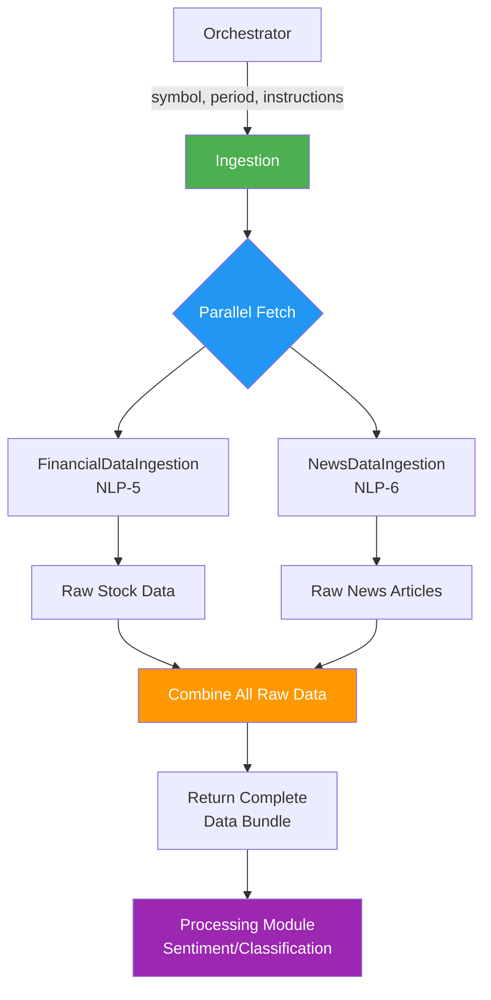
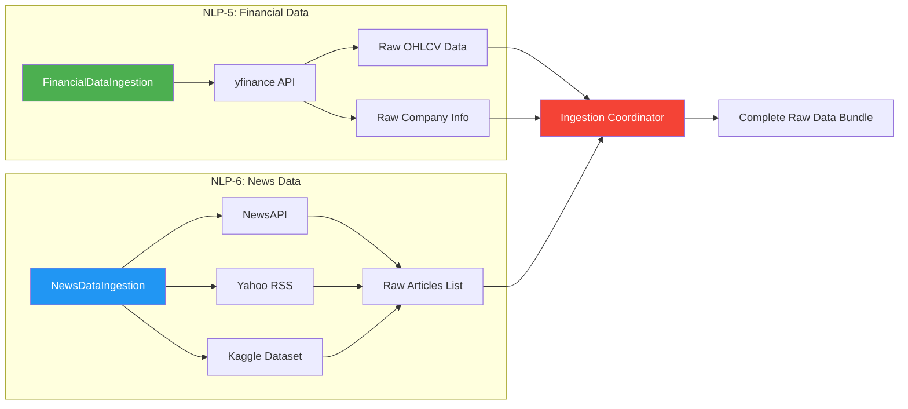
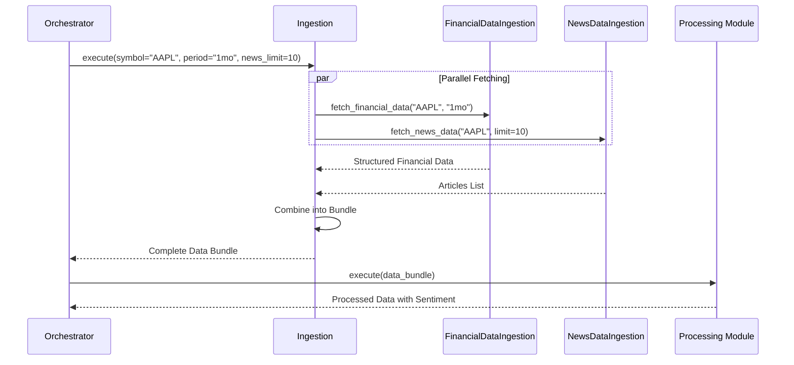

# Ingestion Module - Architecture & Flow

## Overview

The **Ingestion Module** is responsible for fetching structured data from financial and news sources in parallel. It acts as the first stage in the data pipeline, collecting data that will be analyzed by the Processing modules downstream.

**Note**: This is a simplified architecture. The ingestion module fetches data from APIs that already return structured/normalized data, so no separate aggregation layer is needed.

## Core Principle

**Ingestion = Data Fetching ONLY**

- ✅ Fetch raw data from APIs and data sources
- ✅ Handle API errors and rate limits gracefully
- ✅ Execute requests in parallel when possible
- ✅ Return unprocessed/minimally processed data
- ❌ NO data normalization or calculations
- ❌ NO filtering or deduplication

---

## Architecture

### Component Structure

```
src/ingestion/
├── ingestion.py              # Main coordinator (NLP-5 to NLP-8)
├── financial_data.py         # NLP-5: Stock data from Yahoo Finance
├── news_data.py              # NLP-6: News from NewsAPI & Kaggle
└── ingestion-flow.md         # This documentation
```

---

## Data Sources by Task

### NLP-1: Stock Data Ingestion (`financial_data.py`)
**Data Source**: Yahoo Finance (yfinance)
- Historical stock prices (OHLCV)
- Company information
- Stock fundamentals
- Real-time quotes

### NLP-2: News Ingestion (`news_data.py`)
**Data Sources**: NewsAPI, Kaggle datasets, Yahoo Finance RSS
- Recent news articles
- Press releases
- Financial news
- Market sentiment articles

---

## Flowcharts

### High-Level Ingestion Flow



### Detailed Ingestion Component Flow



### Data Flow: Ingestion → Aggregation



---

## Data Structures

### Input to Ingestion

```python
{
    "symbol": "AAPL",           # Required: Stock ticker
    "period": "10d",            # Optional: Time period for historical data
    "news_limit": 10,           # Optional: Number of news articles
    "include_memory": True,     # Optional: Fetch past notes
    "include_additional": True  # Optional: Fetch macro/filings/senate data
}
```

### Output from Ingestion (Raw Data Bundle)

```python
{
    "symbol": "AAPL",
    "timestamp": "2025-10-03T12:00:00Z",
    
    # NLP-1: Financial Data (Raw)
    "financial_data": {
        "historical": DataFrame,     # Raw OHLCV data
        "info": dict,               # Raw company info from yfinance
        "fundamentals": dict        # Raw fundamental metrics
    },
    
    # NLP-2: News Data (Raw)
    "news_data": [
        {
            "title": "Apple announces...",
            "content": "Full article text...",
            "source": "NewsAPI",
            "published": "2025-10-02T...",
            "url": "https://..."
        },
        # ... more articles
    ],
    
    "status": "partial_success"  # or "success" or "failed"
}
```

---

## Simplified Architecture

### What Ingestion Does:
1. ✅ Fetch structured data from APIs (yfinance, NewsAPI, Yahoo RSS)
2. ✅ Handle authentication and rate limits
3. ✅ Basic error handling and retries
4. ✅ Calculate simple metrics (volatility, price changes)
5. ✅ Return structured data ready for processing

### What Processing Does (downstream):
1. ✅ Sentiment analysis on news articles
2. ✅ Entity extraction from text
3. ✅ Text classification
4. ✅ NLP preprocessing

---

## API Links

- **NLP-1**: Yahoo Finance API - https://pypi.org/project/yfinance/
- **NLP-2**: NewsAPI - https://newsapi.org/docs
---


